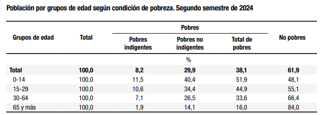
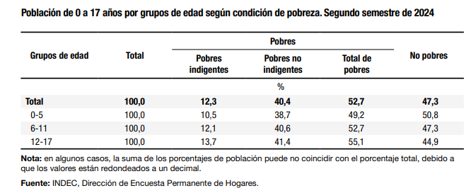

```{r setup, include=FALSE}
knitr::opts_chunk$set(echo = TRUE)
```


```{r message=FALSE, warning=FALSE, include=FALSE}
# Carga de librerias
library(tidyverse)
library(readr)
library(stringr)
library(eph)
library(readxl)
library(writexl)
library(scales)
library(openxlsx)
library(ggplot2)
library(plotly)
library(patchwork)
library(kableExtra)
library(geodata)
library(sf)


# Configuración general: sin notación científica
options(scipen = 999)

# Funcion para formatear números
formato <- function(x){
  format(x, digits = 2, big.mark = ".", decimal.mark = ",")
  }

# Importar bases de datos, seleccionar variables de interés y crear variable " idhogar "

base_ind <- read.csv2("usu_individual_T424.txt") %>%
  select(CODUSU, NRO_HOGAR, COMPONENTE, PONDERA, PONDIH,REGION, CH03, CH04, CH06,
         ESTADO, EMPLEO, SECTOR, V5_01_M, ITF, IPCF, DECCFR, P_DECCF) %>%
  mutate(idhogar = str_c(CODUSU, NRO_HOGAR))

base_hog <- read.csv2("usu_hogar_T424.txt") %>%
  select(CODUSU, NRO_HOGAR, TRIMESTRE, REGION, PONDERA, PONDIH, V5_01, IX_TOT, ITF,
         DECIFR, IPCF, DECCFR) %>%
  mutate(idhogar = str_c(CODUSU, NRO_HOGAR))


```


# Motivaciones y objetivos

La motivación del presente trabajo es indagar sobre el efecto que tienen las transferencias monetarias en concepto de Asignación Universal por Hijo y por Embarazo (AUH y AxE) en los guarismos de pobreza e indigencia de la República Argentina. La AUH ha sido una de las pocas políticas que ha sido sostenida, e incluso reforzada en varias oportunidades, por gobiernos de distinto signo político desde su creación en 2009. 

El sostenimiento y la relevancia que se le ha dado a esta política a lo largo de los años no puede escindirse de una de las problemáticas estructurales más urgentes que atravieza la sociedad argentina: la mayor incidencia de la pobreza en las personas más jóvenes, fundamentalmente, en la niñez. Durante el segundo semestre del 2024, más de la mitad de los menores de 18 años vivían en hogares con ingresos inferiores a la canasta básica total. Y esto no es un fenómoeno nuevo.






En  este sentido, una de las hipótesis que motiva este trabajo es que la AUH es una política central para mitigar la incidencia de la pobreza extrema, fundamentalmente en los más jóvenes, gracias a su alto alcance, su monto significativo y su correcta focalización. A partir de este diagnóstico, se intentará cuantificar el impacto de la AUH en la pobreza y en la indigencia e indagar en las características de los hogares que se han visto beneficiados por estas transferencias.


# Cuestiones metodológicas

A los fines de esta investigación se utilizarán principalmente datos correspondientes al 4to trimestre del 2024 que provee el [INDEC](https://www.indec.gob.ar/).

Específicamente se utilizará, por un lado, la EPH individual del trimestre de referencia para obtener los ingresos declarados (Ingreso Total Familiar y el valor declarado percibido en concepto de AUH[^1] para luego poder restarlo del ITF) y, por otro lado, los valores de las canastas básicas (alimentaria y total) por región y la tabla de adultos equivalentes para definir las líneas de indigencia y pobreza para cada hogar.

En primer lugar se hará una breve caracterización del universo de hogares AUH de acuerdo a diferentes dimensiones. Para trabajos posteriores estas u otras dimensiones pueden ser utilizadas para medir impactos diferenciales en determinados sub-grupos de hogares AUH.

En segunda instancia se elaboraran los indicadores correspondientes a incidencia de pobreza e indigencia a nivel hogares y personas. Luego se harán cortes transversales para diferenciar el impacto según distintos ragos etarios.

Finalmente se elaborará un mapa de cobertura de la AUH sobre el total de jóvenes menores de 18 años a nivel nacional y para el AMBA (40 departamentos de la Provincia de Buenos Aires y CABA). Para esto se utilizarán datos publicados por ANSES y proyecciones poblacionales del INDEC[^2]. A su vez, para elaborar el mapa nacional se utilizará la función geodata, mientras que para el mapa del AMBA se utilizaran archivos extraidos del Instituto Geográfico Nacional [IGN](https://www.ign.gob.ar/NuestrasActividades/InformacionGeoespacial/CapasSIG)


[^1]: Cabe destacar que el diseño de registro de la EPH indica que la variable V5_01_M es la respuesta a la pregunta sobre ingresos percibidos en concepto de AUH, AxE o Prestación Alimentar. Podemos suponer que también pueden estar incluidos otros programas alimentarios como el Programa 1.000 días. Para simplificar cuando mencionemos AUH, estaremos haciendo referencia a todas las transferencias de ingresos mencionadas.

[^2]: El INDEC publica proyecciones poblacionales por rangos etarios para las provincias. Sin embargo, para los partidos, en este caso, de la provincia de Buenos Aires solo publica proyecciones de la población total. En este caso, para proyectar a los menores de 18 años se utilizó el supuesto de que se mantuvo la estructura poblacional del Censo 2022. Esto podría corregirse proyectando una tasa de natalidad que tiende a disminuir más acentuadamente en los últimos años.


# Identificación y caracterización de hogares AUH 


```{r echo=FALSE}
# --- 1. MARCAR HOGAR AUH Y CANTIDAD DE TITULARES POR HOGAR: PUEDE HABER HOGARES CON MÁS DE 1 TITULAR ---
hogar_auh <- base_ind %>%
  group_by(idhogar) %>%
  summarise(
    Hogar_AUH = if_else(any(V5_01_M > 0, na.rm = TRUE), "SI", "NO"),
    Titulares_AUH = sum(V5_01_M > 0, na.rm = TRUE)
  )

# Unir marca AUH y cantidad de titulares a la base hogares
base_hog <- base_hog %>%
  left_join(hogar_auh, by = "idhogar")


# Guardo coeficiente de expansión EPH, total hogares AUH, total de titulares y total de menores en hogares AUH

coef_exp <- 47.1/29.8

# --- Total de hogares AUH

hogares_auh_total <- base_hog %>%
  filter(Hogar_AUH == "SI") %>%
  summarise(total = sum(PONDIH, na.rm = TRUE)) %>%
  pull(total)  # Para guardarlo como Vector y quedarme sólo con el valor

# --- Total de titulares AUH

titulares_auh_total <- base_ind %>%
  filter(V5_01_M > 0) %>%
  summarise(total = sum(PONDIH, na.rm = TRUE)) %>%   
  pull(total)

# --- Total de menores de 18 en hogares AUH
menores_auh_total <- base_ind %>%
  left_join(hogar_auh, by = "idhogar") %>%
  filter(Hogar_AUH == "SI", CH06 < 18) %>%            # CH06 = edad
  summarise(total = sum(PONDIH, na.rm = TRUE)) %>%
  pull(total)


```


Como primer paso se identifican a los `r formato(hogares_auh_total)` hogares que declaran haber percibido ingresos por la AUH para hacer una caracterización del universo "Hogares AUH". En estos hogares se identificaron `r formato(titulares_auh_total)` titulares y `r formato(menores_auh_total)` menores de 18 años.

Cabe recordar que el universo que representa la EPH abarca a 29,8 millones de personas que viven en los 31 aglomerados urbanos más importantes del país. A los fines de comparar con los datos que publica ANSES sobre las personas titulares y los niños y niñas que perciben las asignaciones universales, se utiliza un factor de expansión resultante del cociente entre 47,1 y 29,8 millones de personas. Considerando el coeficiente de expansión identificamos `r formato(titulares_auh_total * coef_exp)` titulares y `r formato(menores_auh_total * coef_exp)` menores de 18 años, similar a los 2,3 millones de titulares y los 4,1 millones de niños y niñas beneficiarios que informa ANSES como promedios del 4to trimestre.


```{r include=FALSE}
### CARACTERIZAR HOGARES 

# Hogares por cantidad de titulares
hogares_por_titulares <- base_hog %>%
  filter(Hogar_AUH == "SI") %>%
  group_by(Titulares_AUH) %>%
  summarise(Hogares = sum(PONDIH, na.rm = TRUE), .groups = "drop") %>%
  mutate(Frecuencia = 100 * Hogares / sum(Hogares))


```

## Caracterización de los hogares

Como primer análisis exploratorio se identificó que, si bien el 95% de los hogares AUH tienen una única persona titular, también existen hogares donde conviven 2 y hasta 3 titulares de AUH, pudiendo ser el caso de una madre con hijo/s menores de 18 años y 2 hijas, también con hijos menores de 18 años.

Otra cuestión a mencionar es que dentro del universo "Hogares AUH" detectado hay hogares que entre sus componentes no tienen a ningún menor de 18 años, pudiendose tratar de familias percibiendo asignaciones por hijo con discapacidad, las cuales no tienen restricción por edad.

Para el próximo análisis donde se compara la distribución de hogares AUH y NO AUH según la cantidad de menores se descartaron los casos que no tienen ningún menor para poder comparar universos similares. En promedio, los hogares AUH tienen 2,3 menores mientras que, los hogares NO AUH con menores tienen, en promedio, 1,61. A continuación se observa la distribución de todos los hogares (AUH y NO AUH) con menores según la cantidad de menores.


```{r echo=FALSE}
# --- 1. Contar cantidad de menores por hogar
menores_por_hogar <- base_ind %>%
  filter(CH06 < 18) %>%
  group_by(idhogar) %>%
  summarise(Menores18 = n())

# --- 2. Unir a la base hogares 
base_hog2 <- base_hog %>%
  left_join(menores_por_hogar, by = "idhogar") %>%
  mutate(Menores18 = if_else(is.na(Menores18), 0L, Menores18))

# --- 3. Agrupar en categorías
base_hog2 <- base_hog2 %>%
  mutate(
    Menores_cat = case_when(
      Menores18 == 0 ~ "0",
      Menores18 == 1 ~ "1",
      Menores18 == 2 ~ "2",
      Menores18 == 3 ~ "3",
      Menores18 >= 4 ~ "4 o más"
    )
  )

# --- 4. Tabla comparativa AUH vs No AUH (sólo hogares con menores) ---
hogares_por_menores_comp <- base_hog2 %>%
  filter(Menores18 > 0) %>%
  group_by(Hogar_AUH, Menores_cat) %>%
  summarise(Hogares = sum(PONDIH, na.rm = TRUE), .groups = "drop") %>%
  group_by(Hogar_AUH) %>%
  mutate(Frecuencia = 100 * Hogares / sum(Hogares)) %>%
  ungroup()

# --- 5. Calcular promedio de menores por hogar en cada grupo 
promedio_menores <- base_hog2 %>%
  filter(Menores18 > 0) %>%
  group_by(Hogar_AUH) %>%
  summarise(Promedio = weighted.mean(Menores18, w = PONDIH, na.rm = TRUE))

# --- 6. Gráfico hogares con menores, AUH y NO AUH, por cantidad de menores ---
g1_hogares_menores_auh_noauh <-  ggplot(hogares_por_menores_comp, aes(x = Menores_cat, y = Frecuencia, fill = Hogar_AUH)) +
  geom_col(position = position_dodge(width = 0.8), width = 0.7) +
  geom_text(aes(label = paste0(round(Frecuencia, 1), "%")),
            position = position_dodge(width = 0.8),
            vjust = -0.5, size = 3) +
  labs(
    title = "Distribución de hogares AUH y No AUH según cantidad de menores",
    subtitle = "Hogares con al menos 1 menor. La distribución corresponde a cada grupo.",
    x = "Cantidad de menores en el hogar",
    y = "Frecuencia (%)",
    fill = "Hogar AUH",
    caption = "Fuente: Elaboración propia en base a EPH 4Q-2024"
  ) +
  theme_minimal(base_size = 12) +
  ylim(0, max(hogares_por_menores_comp$Frecuencia) * 1.2)


g1_hogares_menores_auh_noauh
```

Otra dimensión relevante para analizar es la vinculada a las estrategias de organización de estos hogares. Una breve indagación sobre la situación ocupacional de los jefes de hogar en los hogares AUH revela que más del 70% son personas ocupadas que, para poder percibir la AUH, deben estar en condiciones de informalidad o bajo convenios de casas particulares o monotributo social, o bien, el jefe de hogar puede ser ocupado formal, pero no tener vínculo legal con la persona titular de la AUH. En el 5% de los casos, los jefes de hogar se encuentran desocupados y en el 21% son inactivos. 

Además, en la mitad de los hogares AUH la persona titular de la asignación es también jefe/a de hogar.


```{r include=FALSE}

### HOGARES SEGUN TITULAR AUH ES JEFE O NO

titular_jefe <- base_ind %>%
  filter(V5_01_M > 0) %>%
  group_by(idhogar) %>%
  summarise(Titular_Jefe = if_else(any(CH03 == 1, na.rm = TRUE), "Sí", "No"))

base_hog3 <- base_hog %>%
  left_join(titular_jefe, by = "idhogar")

hogares_por_titular_jefe <- base_hog3 %>%
  filter(Hogar_AUH == "SI") %>%
  group_by(Titular_Jefe) %>%
  summarise(Hogares = sum(PONDIH, na.rm = TRUE), .groups = "drop") %>%
  mutate(Frecuencia = 100 * Hogares / sum(Hogares))

```


```{r include=FALSE}

### HOGARES AUH SEGUN ESTADO OCUPACIONAL DEL JEFE DE HOGAR

jefes_estado <- base_ind %>%
  filter(CH03 == 1) %>%
  select(idhogar, ESTADO)

base_hog4 <- base_hog %>%
  left_join(jefes_estado, by = "idhogar")

hogares_por_estado_jefe <- base_hog4 %>%
  filter(Hogar_AUH == "SI") %>%
  group_by(ESTADO) %>%
  summarise(Hogares = sum(PONDIH, na.rm = TRUE), .groups = "drop") %>%
  mutate(Frecuencia = 100 * Hogares / sum(Hogares))

```


Todas estas indagaciones requerirían una investigación un poco más profunda para poder extraer conclusiones más precisas sobre las estrategias de estos hogares. Sin embargo, este trabajo se limitará a estudiar el impacto de la AUH sobre el total de las tasas de pobreza e indigencia, con un cruce por edad. En futuros trabajos se podría observar impactos diferenciados en distintos grupos de hogares que permite identificar la EPH.


## Focalización de la política

Con respecto a la focalización de la política, la misma pareciera ser acertada ya que, como puede verse a continuación, casi el 76% de los hogares AUH se ubica en los 3 primeros deciles de ingreso per cápita familiar (IPCF).


```{r echo=FALSE}

# --- 1. TABLA RESUMEN POR DECIL ---
auh_por_decil <- base_hog %>%
  filter(DECCFR %in% 1:10) %>%  # Descarto hogares sin ingresos (DECCFR = 0, solo NO AUH) y no respuestas (DECCFR = 12) , aunque estos los descarto al usar PONDIH
  group_by(DECCFR, Hogar_AUH) %>%
  summarise(hogares = sum(PONDIH, na.rm = TRUE), .groups = "drop") %>%
  group_by(DECCFR) %>%
  mutate(porc_en_decil = hogares / sum(hogares) * 100) %>%  # % de cada tipo de hogar dentro de cada decil
  ungroup() %>%
  group_by(Hogar_AUH) %>%
  mutate(porc_total_AUH = if_else(Hogar_AUH == "SI",
                                  hogares / sum(hogares[Hogar_AUH == "SI"]) * 100,
                                  NA_real_)) %>%            # Distribución de Hogares AUH entre los deciles
  ungroup()

############################################    GRAFICOS    ######################################################################

# --- 2. GRAFICO 2: Distribución de los hogares AUH entre los deciles por IPCF ---
g2_distribucion_auh_decil <- ggplot(auh_por_decil %>% filter(Hogar_AUH == "SI"),
             aes(x = factor(DECCFR), y = porc_total_AUH)) +
  geom_col(fill = "#2C7BB6") +
  geom_text(aes(label = paste0(round(porc_total_AUH, 1), "%")),
            vjust = -0.5, size = 3.5) +
  labs(
    title = "Distribución de hogares AUH entre deciles",
    x = "Decil de ingresos (IPCF)",
    y = "% de hogares AUH (sobre total AUH)",
    caption = "Fuente: Elaboración propia en base a EPH 4Q-2024"
  ) +
  scale_y_continuous(labels = scales::percent_format(scale = 1),
                     expand = expansion(mult = c(0, 0.1))) +
  theme_minimal()


# --- 3. MOSTRAR GRAFICO 2
g2_distribucion_auh_decil 
```

Por otra parte, se puede observar la incidencia de los hogares AUH en cada decil reflejando que casi la mitad de los hogares del primer decil y cerca de 1 tercio del segundo decil perciben la AUH.

```{r echo=FALSE}

# --- 3. GRAFICO 3: % HOGARES AUH SOBRE TOTAL DE CADA DECIL ---
g3_incidencia_auh_decil <- ggplot(auh_por_decil %>% filter(Hogar_AUH == "SI"),
             aes(x = factor(DECCFR), y = porc_en_decil)) +
  geom_col(fill = "#2C7BB6") +
  geom_text(aes(label = paste0(round(porc_en_decil, 1), "%")),
            vjust = -0.5, size = 3.5) +
  labs(
    title = "Incidencia de hogares AUH por decil",
    x = "Decil de ingresos (IPCF)",
    y = "% de hogares AUH en cada decil",
    caption = "Fuente: Elaboración propia en base a EPH 4Q-2024"
  ) +
  scale_y_continuous(labels = scales::percent_format(scale = 1),
                     expand = expansion(mult = c(0, 0.1))) +
  theme_minimal()

# ---  MOSTRAR GRAFICO 2
g3_incidencia_auh_decil
```


# Impacto sobre la pobreza e indigencia

Una ves identificado que los hogares que perciben AUH se ubican en los deciles más bajos según sus ingresos per cápita, se procede a estimar la incidencia de la pobreza y la indigencia para todos los hogares de la muestra en dos escenarios comparados. Por un lado, el escenario original que refleja la EPH y por otro lado, un escenario simulado que extrae del ingreso total familiar aquel ingreso declarado en concepto de AUH. De esta forma se obtienen los guarismos estimados de pobreza e indigencia en el escenario original (Con AUH) y en el escenario simulado (Sin AUH) para evaluar el impacto que tendría la AUH a la hora de reducir estas incidencias.


```{r include=FALSE}

##################################     IDENTIFICAR HOGARES POBRES E INDIGENTES #######################################

# --- 1. CARGAR TABLA DE ADULTOS EQUIVALENTES: INDEC
ae_rangos <- tribble(
  ~edad_min, ~edad_max, ~mujer, ~varon,
  -1, 0, 0.35, 0.35,
  1, 1, 0.37, 0.37,
  2, 2, 0.46, 0.46,
  3, 3, 0.51, 0.51,
  4, 4, 0.55, 0.55,
  5, 5, 0.60, 0.60,
  6, 6, 0.64, 0.64,
  7, 7, 0.66, 0.66,
  8, 8, 0.68, 0.68,
  9, 9, 0.69, 0.69,
  10, 10, 0.70, 0.79,
  11, 11, 0.72, 0.82,
  12, 12, 0.74, 0.85,
  13, 13, 0.76, 0.90,
  14, 14, 0.76, 0.96,
  15, 15, 0.77, 1.00,
  16, 16, 0.77, 1.03,
  17, 17, 0.77, 1.04,
  18, 29, 0.76, 1.02,
  30, 45, 0.77, 1.00,
  46, 60, 0.76, 1.00,
  61, 75, 0.67, 0.83,
  76, 200, 0.63, 0.74
)


# --- 2. ASIGNAR AE PARA CADA REGISTRO INDIVIDUAL SEGÚN SEXO Y EDAD 
base_ind <- base_ind %>%
  rowwise() %>%           # Para operar fila por fila
  mutate(AE = {           # Las llaves agrupan bloque de código, en este caso que se ejecuta fila por fila
    fila <- ae_rangos %>% filter(CH06 >= edad_min, CH06 <= edad_max) # Me quedo con los valores de edad min y max de cada fila
    if (nrow(fila) == 1) {
      if (CH04 == 1) fila$varon else if (CH04 == 2) fila$mujer else NA
    } else NA
  }) %>%
  ungroup()

# ---3. CALCULAR AE POR HOGAR Y PEGAR EN BASE INDIVIDUAL
ae_por_hogar <- base_ind %>%
  group_by(idhogar) %>%
  summarise(AE_hogar = sum(AE, na.rm = TRUE))

base_ind <- base_ind %>%
  left_join(ae_por_hogar, by = "idhogar")

# --- 4. CARGAR VALORES DE CANASTAS POR REGION Y ETIQUETAS 

# Cargar tabla de CBA y CBT por región (PROMEDIO DEL 4to TRIMESTRE)
canastas_region <- tribble(
  ~Region,              ~CBA,      ~CBT,
  "Gran Buenos Aires",  142737,    324972,
  "Cuyo",               127026,    307837,
  "Noreste",            126651,    270200,
  "Noroeste",           123650,    261321,
  "Pampeana",           140926,    320848,
  "Patagonia",          146785,    379207
)

# EtiquetaS REGION
region_labels <- c(
  "1" = "Gran Buenos Aires",
  "43" = "Pampeana",
  "44" = "Patagonia",
  "40" = "Noroeste",
  "41" = "Noreste",
  "42" = "Cuyo"
)

# --- 5. PEGAR VALORES DE CBT Y CBA POR REGION, CALCULAR LINEAS DE POBREZA E INDIGENCIA Y CALCULAR LA SITUACION DE POBREZA
base_ind <- base_ind %>%
  mutate(REGION_LABEL = recode(as.character(REGION), !!!region_labels)) %>%
  left_join(canastas_region, by = c("REGION_LABEL" = "Region")) %>%
  mutate(
    LI = AE_hogar * CBA,
    LP = AE_hogar * CBT,
    situacion_pobreza = case_when(
      ITF < LI ~ "Indigente",
      ITF < LP ~ "Pobre no indigente",
      TRUE ~ "No pobre"
    )
  )


```

```{r include=FALSE}
### MODELIZAR SITUACION POBREZA SIN AUH E IDENTIFICAR HOGARES Y PERSONAS BENEFICIADAS

# --- 1. Sumar AUH total por hogar (sólo los titulares AUH)
auh_por_hogar <- base_ind %>%
  group_by(idhogar) %>%
  summarise(monto_auh = sum(V5_01_M, na.rm = TRUE))


# --- 2. Juntar con base_ind, calcular ITF sin AUH y recalcular situacion_pobreza_sin_auh
base_ind <- base_ind %>%
  left_join(auh_por_hogar, by = "idhogar") %>%
  mutate(
    itf_sin_auh = ITF - monto_auh,
    situacion_pobreza_sin_auh = case_when(
      itf_sin_auh < LI ~ "Indigente",
      itf_sin_auh < LP ~ "Pobre no indigente",
      TRUE ~ "No pobre"
    )
  )

```

## Impacto a nivel hogares

En primer lugar se observa el impacto a nivel hogares. Con la AUH, en el escenario original las tasas de pobreza e indigencia para el 4to trimestre del 2024 arrojan 28,2% y 5,8%, respectivamente. Las estimaciones de este trabajo se ubican en línea con el cálculo que realiza el INDEC con frecuencia semestral, que arrojan guarismos de 28,6% y 6,4% de pobreza e indigencia en hogares para el segundo semestre del 2024. Tiene sentido que nuestros datos se ubiquen por debajo ya que, se verificó una tendencia hacia la disminución durante los 2 últimos trimestres del 2024.

```{r echo=FALSE}


############################### OBTENER RESULTADOS A NIVEL HOGARES   ##########################

# --- 1.  Filtrar solo jefes/as de hogar y seleccionar las variables
pobreza_por_hogar <- base_ind %>%
  filter(CH03 == 1) %>%  # jefe/a de hogar
  select(idhogar, situacion_pobreza, situacion_pobreza_sin_auh)

# --- 2. Hacer el join con base_hog
base_hog <- base_hog %>%
  left_join(pobreza_por_hogar, by = "idhogar")

# Calcular indicadores
tabla_hogares <- base_hog %>%
                # Creo variables booleanas para marcar hogares según situación
  mutate(
    es_pobre_con_auh = situacion_pobreza %in% c("Indigente", "Pobre no indigente"),
    es_indigente_con_auh = situacion_pobreza == "Indigente",
    es_pobre_sin_auh = situacion_pobreza_sin_auh %in% c("Indigente", "Pobre no indigente"),
    es_indigente_sin_auh = situacion_pobreza_sin_auh == "Indigente"
  ) %>%
  
              # Sumo PONDIH para los valores TRUE de las booleanas anteriores
  summarise(
    total = sum(PONDIH, na.rm = TRUE),
    pobreza_con = sum(PONDIH[es_pobre_con_auh], na.rm = TRUE) / total * 100,
    pobreza_sin = sum(PONDIH[es_pobre_sin_auh], na.rm = TRUE) / total * 100,
    indigencia_con = sum(PONDIH[es_indigente_con_auh], na.rm = TRUE) / total * 100,
    indigencia_sin = sum(PONDIH[es_indigente_sin_auh], na.rm = TRUE) / total * 100
  ) %>%
              # Crear la tabla final a mano para armarla como yo quiero mostrarla
  { tibble(
    Variable = c("Pobreza", "Indigencia"),
    `Con AUH` = c(.$pobreza_con, .$indigencia_con),
    `Sin AUH` = c(.$pobreza_sin, .$indigencia_sin),
    `Impacto p.p.` = `Con AUH` - `Sin AUH`,
    `Impacto %` = (`Con AUH` - `Sin AUH`) / `Sin AUH` * 100
  )}

              # Agrego formatos

tabla1_impacto_hogares <- tabla_hogares %>%
  mutate(
    `Con AUH` = percent(`Con AUH` / 100, accuracy = 0.1, decimal.mark = ","),
    `Sin AUH` = percent(`Sin AUH` / 100, accuracy = 0.1, decimal.mark = ","),
    `Impacto p.p.` = number(`Impacto p.p.`, accuracy = 0.1, decimal.mark = ","),
    `Impacto %` = percent(`Impacto %` / 100, accuracy = 0.1, decimal.mark = ",")
  )

tabla1_impacto_hogares %>%
  kable("html", caption = "Tasas de Pobreza e Indigencia a nivel hogares") %>%
  kable_styling(full_width = FALSE, bootstrap_options = c("striped", "hover")) %>%
  column_spec(1, bold = TRUE)

```

El escenario simulado arroja incidencias más altas: 29,5% de pobreza y 8,8% de indigencia. En este sentido, como primer hallazgo observamos que es significativo el impacto que tiene la AUH para sacar hogares de la pobreza extrema y reducir la tasa de indigencia.

## Impacto a nivel personas

Como segundo análisis de impacto se estima la reducción de tasas a nivel personas, distinguiendo según grupos etarios.

```{r include=FALSE}
################################ OBTENER RESULTADOS A NIVEL PERSONAS Y ARMAR TABLAS RESULTADOS ################################

# --- 1. Calcular tabla por grupo etario
tabla_personas <- base_ind %>%
  mutate(grupo_edad = case_when(
    CH06 < 18 ~ "Menores de 18",
    CH06 >= 18 & CH06 <= 35 ~ "18 a 35",
    CH06 > 35 ~ "Mayores de 35"
  )) %>%
  group_by(grupo_edad) %>%
  summarise(
    total = sum(PONDIH, na.rm = TRUE),
    
    pobres_con_auh = sum(PONDIH[situacion_pobreza %in% c("Indigente", "Pobre no indigente")], na.rm = TRUE),
    pobres_sin_auh = sum(PONDIH[situacion_pobreza_sin_auh %in% c("Indigente", "Pobre no indigente")], na.rm = TRUE),
    
    indigentes_con_auh = sum(PONDIH[situacion_pobreza == "Indigente"], na.rm = TRUE),
    indigentes_sin_auh = sum(PONDIH[situacion_pobreza_sin_auh == "Indigente"], na.rm = TRUE)
  ) %>%
  mutate(
    tasa_pobreza_con = 100 * pobres_con_auh / total,
    tasa_pobreza_sin = 100 * pobres_sin_auh / total,
    impacto_pp_pobreza = tasa_pobreza_con - tasa_pobreza_sin,
    impacto_pct_pobreza = 100 * impacto_pp_pobreza / tasa_pobreza_sin,
    
    tasa_indigencia_con = 100 * indigentes_con_auh / total,
    tasa_indigencia_sin = 100 * indigentes_sin_auh / total,
    impacto_pp_indigencia = tasa_indigencia_con - tasa_indigencia_sin,
    impacto_pct_indigencia = 100 * impacto_pp_indigencia / tasa_indigencia_sin
  )

# --- 2. Calcular totales nacionales
totales_nacionales <- base_ind %>%
  summarise(
    total = sum(PONDIH, na.rm = TRUE),
    
    pobres_con_auh = sum(PONDIH[situacion_pobreza %in% c("Indigente", "Pobre no indigente")], na.rm = TRUE),
    pobres_sin_auh = sum(PONDIH[situacion_pobreza_sin_auh %in% c("Indigente", "Pobre no indigente")], na.rm = TRUE),
    
    indigentes_con_auh = sum(PONDIH[situacion_pobreza == "Indigente"], na.rm = TRUE),
    indigentes_sin_auh = sum(PONDIH[situacion_pobreza_sin_auh == "Indigente"], na.rm = TRUE)
  ) %>%
  mutate(
    tasa_pobreza_con = 100 * pobres_con_auh / total,
    tasa_pobreza_sin = 100 * pobres_sin_auh / total,
    impacto_pp_pobreza = tasa_pobreza_con - tasa_pobreza_sin,
    impacto_pct_pobreza = 100 * impacto_pp_pobreza / tasa_pobreza_sin,
    
    tasa_indigencia_con = 100 * indigentes_con_auh / total,
    tasa_indigencia_sin = 100 * indigentes_sin_auh / total,
    impacto_pp_indigencia = tasa_indigencia_con - tasa_indigencia_sin,
    impacto_pct_indigencia = 100 * impacto_pp_indigencia / tasa_indigencia_sin
  ) %>%
  mutate(grupo_edad = "Total")

# --- 3. Unir tabla por grupo etario + total
tabla_personas_final <- bind_rows(tabla_personas, totales_nacionales)

# --- 3. Reorganizar en formato limpio
tabla_personas_final <- tabla_personas_final %>%
  transmute(
    `Grupo etario` = grupo_edad,
    
    pobreza_con = tasa_pobreza_con,
    pobreza_sin = tasa_pobreza_sin,
    pobreza_pp = impacto_pp_pobreza,
    pobreza_pct = impacto_pct_pobreza,
    
    indigencia_con = tasa_indigencia_con,
    indigencia_sin = tasa_indigencia_sin,
    indigencia_pp = impacto_pp_indigencia,
    indigencia_pct = impacto_pct_indigencia
  ) %>%
  pivot_longer(
    cols = -`Grupo etario`,
    names_to = c("Variable", "Indicador"),
    names_pattern = "(.*)_(con|sin|pp|pct)",
    values_to = "valor"
  ) %>%
  pivot_wider(
    names_from = Indicador,
    values_from = valor
  ) %>%
  rename(
    `Con AUH` = con,
    `Sin AUH` = sin,
    `Impacto p.p.` = pp,
    `Impacto %` = pct
  ) %>%
  mutate(Variable = str_to_title(Variable)) %>%
  select(`Grupo etario`, Variable, `Con AUH`, `Sin AUH`, `Impacto p.p.`, `Impacto %`)

# --- 4. Agregar formatos

tabla2_impacto_personas_por_edad <- tabla_personas_final %>%
  mutate(
    `Con AUH` = percent(`Con AUH` / 100, accuracy = 0.1, decimal.mark = ","),
    `Sin AUH` = percent(`Sin AUH` / 100, accuracy = 0.1, decimal.mark = ","),
    `Impacto p.p.` = number(`Impacto p.p.`, accuracy = 0.1, decimal.mark = ","),
    `Impacto %` = percent(`Impacto %` / 100, accuracy = 0.1, decimal.mark = ",")
  )


```

Nuevamente, como primer verificación los resultados del escenario original están en línea con los cálculos del INDEC. Nuestras estimaciones arrojan una pobreza a nivel personas del 37,8% y una indigencia del 7,3% para el 4to trimestre del 2024, mientras que el INDEC informó guarismos del 38,1% y 8,2%, respectivamente para el segundo semestre del 2024.

En segunda instancia, nuevamente observamos un impacto mucho más significativo en la reducción de la indigencia gracias a la AUH.

Además, en los cuadros debajo puede observarse un impacto decreciente a mayor edad lo cual revela la importancia de esta política para contener parcialmente a los sectores más vulnerables: menores de edad que viven en situación de pobreza extrema.


```{r echo=FALSE}

### DAR FORMATOS PARA MOSTRAR TABLAS KABLEXTRA

# ---1. Ordenar los grupos etarios ---
orden_grupos <- c("Menores de 18", "18 a 35", "Mayores de 35", "Total")

# ---2. Dividir en dos tablas ---
tabla3_pobreza <- tabla2_impacto_personas_por_edad %>%
  filter(Variable == "Pobreza") %>%
  mutate(`Grupo etario` = factor(`Grupo etario`, levels = orden_grupos)) %>%
  arrange(`Grupo etario`) %>%
  select(-Variable)

tabla4_indigencia <- tabla2_impacto_personas_por_edad %>%
  filter(Variable == "Indigencia") %>%
  mutate(`Grupo etario` = factor(`Grupo etario`, levels = orden_grupos)) %>%
  arrange(`Grupo etario`) %>%
  select(-Variable)

# --- Mostrar tablas una debajo de la otra ---
tabla3_pobreza %>%
  kable("html", caption = "Tasas de Pobreza por Grupo Etario (Personas)") %>%
  kable_styling(full_width = FALSE, bootstrap_options = c("striped", "hover")) %>%
  column_spec(1, bold = TRUE) %>%
  row_spec(nrow(tabla3_pobreza), bold = TRUE)

tabla4_indigencia %>%
  kable("html", caption = "Tasas de Indigencia por Grupo Etario (Personas)") %>%
  kable_styling(full_width = FALSE, bootstrap_options = c("striped", "hover")) %>%
  column_spec(1, bold = TRUE) %>%
  row_spec(nrow(tabla4_indigencia), bold = TRUE)
```


```{r include=FALSE}

                                         ########### VER SI QUIERO DECIR ALGO CON ESTO  ###################

# --- MARCAR A LOS HOGARES QUE SALIERON DE LA POBREZA O INDIGENCIA GRACIAS A LA AUH

base_ind <- base_ind %>%
  mutate(
    salio_indigencia = situacion_pobreza_sin_auh == "Indigente" & 
      situacion_pobreza %in% c("Pobre no indigente", "No pobre"),
    
    salio_pobreza = situacion_pobreza_sin_auh == "Pobre no indigente" & 
      situacion_pobreza == "No pobre",
    
    salio_total = salio_indigencia | salio_pobreza
  )

# CONTAR HOGARES Y PERSONAS QUE SALIERON DE LA POBREZA / INDIGENCIA GRACIAS A AUH

resumen_salida_pobreza_hogares <- base_ind %>%
  filter(CH03 == 1) %>%  # Para contar una vez por hogar (jefes/as)
  summarise(
    hogares_salieron_indigencia = sum(PONDIH[salio_indigencia], na.rm = TRUE),
    hogares_salieron_pobreza = sum(PONDIH[salio_pobreza], na.rm = TRUE),
    hogares_salieron_total = sum(PONDIH[salio_total], na.rm = TRUE)
  )

resumen_salida_pobreza_personas <- base_ind %>%
  summarise(
    personas_salieron_indigencia = sum(PONDIH[salio_indigencia], na.rm = TRUE),
    personas_salieron_pobreza = sum(PONDIH[salio_pobreza], na.rm = TRUE),
    personas_salieron_total = sum(PONDIH[salio_total], na.rm = TRUE)
  )
```


```{r eval=FALSE, include=FALSE}
      
       ###########           PARA SEGUIR INVESTIGANDO                     #######################

####################      IMPACTO EN BRECHAS Y "PROFUNDIDAD" DE LA POBREZA         ##########################

              ###         PENSAR SI TIENE SENTIDO COMPARAR 2 UNIVERSOS DISTINTOS 

# --- 1. Preparar base hogares con variables de interés y calculo total de personas por hogar
base_brecha <- base_ind %>%
  filter(CH03 == 1) %>%  # jefe/a de hogar
  select(idhogar, PONDIH, AE_hogar, LI, LP, ITF, itf_sin_auh,
         situacion_pobreza, situacion_pobreza_sin_auh) %>%
  mutate(
    n_personas = base_ind %>% group_by(idhogar) %>% summarise(n = n(), .groups = "drop") %>% pull(n)       #### OJO HAY HOGARES CON 15 PERSONAS Y 0,6 AE
  )


# --- 2. Armar tabla resumen de hogares indigentes escenario CON AUH
tabla_indigencia_con <- base_brecha %>%
  filter(situacion_pobreza == "Indigente") %>%
  summarise(
    `Incidencia (%)` = sum(PONDIH) / sum(base_brecha$PONDIH) * 100,
    `Tamaño hogar (personas)` = weighted.mean(n_personas, PONDIH),
    `Tamaño hogar (AE)` = weighted.mean(AE_hogar, PONDIH),
    `CBA hogar promedio` = weighted.mean(LI, PONDIH),
    `ITF promedio` = weighted.mean(ITF, PONDIH),
    `Brecha monetaria promedio` = `CBA hogar promedio` - `ITF promedio`,
    `Brecha porcentual promedio` = `Brecha monetaria promedio` / `CBA hogar promedio`,
    `AUH incluida` = "Sí"
  )

# --- 3. Armar tabla resumen de hogares indigentes escenario  SIN AUH
tabla_indigencia_sin <- base_brecha %>%
  filter(situacion_pobreza_sin_auh == "Indigente") %>%
  summarise(
    `Incidencia (%)` = sum(PONDIH) / sum(base_brecha$PONDIH) * 100,
    `Tamaño hogar (personas)` = weighted.mean(n_personas, PONDIH),
    `Tamaño hogar (AE)` = weighted.mean(AE_hogar, PONDIH),
    `CBA hogar promedio` = weighted.mean(LI, PONDIH),
    `ITF promedio` = weighted.mean(itf_sin_auh, PONDIH),
    `Brecha monetaria promedio` = `CBA hogar promedio` - `ITF promedio`,
    `Brecha porcentual promedio` = `Brecha monetaria promedio` / `CBA hogar promedio`,
    `AUH incluida` = "No"
  )

# Combinar ambas en una sola tabla para comparación
tabla_comparativa_indigencia <- bind_rows(tabla_indigencia_con, tabla_indigencia_sin)
```


## Impacto a nivel geográfico

A partir de datos publicados por ANSES referidos a los pagos de la AUH y a proyecciones de la población menor de 18 años del Censo de 2022 se elaboran los siguientes mapas de cobertura que ilustran el porcentaje de menores que perciben la AUH sobre el total de menores de cada provincia.

Cabe destacar una mayor cobertura en las provincias del Noreste: Santiago del Estero, Chaco y Formosa y una menor cobertura en las provincias del Sur: Tierra del Fuego, Santa Cruz, Chubut y Neuquén. Estos datos podrían cruzarse con la proporción de empleo registrado en esas provincias para profundizar el análisis.

```{r echo=FALSE, warning=FALSE}
         
  ############            MAPA NACIONAL             #######     VER SI ANDA GEODATA        #########

# 1. Armar el dataframe con los valores de cobertura por provincia
cobertura_auh_nacional <- tribble(
  ~provincia, ~cobertura,
  "Buenos Aires", 0.286935271,
  "CABA", 0.15339184,
  "Catamarca", 0.276317512,
  "Chaco", 0.418166991,
  "Chubut", 0.157075045,
  "Córdoba", 0.270555577,
  "Corrientes", 0.367039921,
  "Entre Ríos", 0.276081181,
  "Formosa", 0.412859643,
  "Jujuy", 0.294582971,
  "La Pampa", 0.232427055,
  "La Rioja", 0.285498476,
  "Mendoza", 0.291328734,
  "Misiones", 0.401411693,
  "Neuquén", 0.165075944,
  "Río Negro", 0.209300364,
  "Salta", 0.335848312,
  "San Juan", 0.367252206,
  "San Luis", 0.288210592,
  "Santa Cruz", 0.139561027,
  "Santa Fe", 0.283406767,
  "Santiago del Estero", 0.419601318,
  "Tierra del Fuego", 0.125478521,
  "Tucumán", 0.340883544
)

# 2. Descargar y cargar el shapefile de provincias de Argentina
provincias_sf <- geodata::gadm(country = "ARG", level = 1, path = tempdir()) %>% 
  st_as_sf()

# 3. Unir por nombre de provincia
# Algunos nombres difieren, por lo que se ajustan
provincias_sf <- provincias_sf %>%
  mutate(provincia = case_when(
    NAME_1 == "Ciudad Autónoma de Buenos Aires" ~ "CABA",
    TRUE ~ NAME_1
  ))

# 4. Unir los datos de cobertura
data_cobertura_mapa <- provincias_sf %>%
  left_join(cobertura_auh_nacional, by = "provincia")

# 5. Graficar el mapa
mapa1_cobertura_nacional <- ggplot(data_cobertura_mapa) +
  geom_sf(aes(fill = cobertura), color = "white", size = 0.2) +
  scale_fill_gradient(low = "#c6dbef", high = "#08306b", 
                      name = "% Cobertura AUH",
                      labels = scales::percent_format(accuracy = 1)) +
  labs(
    title = "Cobertura de AUH por provincia",
    subtitle = "Proporción de menores de 18 años que perciben AUH sobre el total de menores",
    caption = "Fuente: Elaboración propia en base a EPH"
  ) +
  theme_minimal() +
  theme(
    legend.position = "right",
    plot.title = element_text(size = 16, face = "bold"),
    plot.subtitle = element_text(size = 12),
    axis.text = element_blank(),
    axis.title = element_blank()
  )


mapa1_cobertura_nacional


```


```{r warning=FALSE, include=FALSE}
### MAPA AMBA : 40 PARTIDOS + CABA
# --- 1. CARGAR SHAPEFILE IGN 
dptos <- st_read("departamento/departamentoPolygon.shp")

# --- 2. FILTRAR PARTIDOS DE PBA
dptos_pba <- dptos %>%
  filter(grepl("^06", in1)) %>% 
  mutate(partido = nam) %>% 
  arrange(partido)

# --- 3. PARTIDOS PBA NOMBRE ANSES     -> tuve que reordenar para pegarlo al df
partidos_pba_anses <-  c( 
  "25 de Mayo" , "9 de Julio" , "Adolfo Alsina" , "Adolfo Gonzales Chaves" , "Alberti" ,
  "Almirante Brown" , "Arrecifes" , "Avellaneda" , "Ayacucho" , "Azul" , "Bahía Blanca" ,
  "Balcarce" , "Baradero" , "Benito Juárez" , "Berazategui" , "Berisso" , "Bolívar" ,
  "Bragado" , "Brandsen" , "Campana"  , "Capitán Sarmiento" , "Carlos Casares" ,
  "Carlos Tejedor" , "Carmen de Areco" , "Castelli" , "Cañuelas",  "Chacabuco" , "Chascomús" , "Chivilcoy" ,
  "Colón"  , "Coronel Dorrego" , "Coronel Pringles" ,  "Coronel Suárez" , "Coronel de Marina Leonardo Rosales",
  "Daireaux" , "Dolores" , "Ensenada" , "Escobar" , "Esteban Echeverría" ,
  "Exaltación de la Cruz" , "Ezeiza" , "Florencio Varela" , "Florentino Ameghino" ,
  "General Alvarado" , "General Alvear" , "General Arenales" , "General Belgrano" ,
  "General Guido" , "General Juan Madariaga" , "General La Madrid" , "General Las Heras"
  , "General Lavalle" , "General Paz" , "General Pinto" , "General Pueyrredón" , "General Rodríguez" 
  , "General San Martín" , "General Viamonte" , "General Villegas" , "Guaminí" , "Hipólito Yrigoyen"
  , "Hurlingham" , "Ituzaingó" , "José C. Paz" , "Junín" , "La Costa" , "La Matanza" , "La Plata" , "Lanús" ,
  "Laprida" , "Las Flores" , "Leandro N. Alem" , "Lezama", "Lincoln" , "Lobería" , "Lobos" , "Lomas de Zamora" , "Luján"   # Tuve que agregar Lezama
  , "Magdalena" , "Maipú" , "Malvinas Argentinas" , "Mar Chiquita" , "Marcos Paz" , "Mercedes" , "Merlo" , "Monte" 
  , "Monte Hermoso" , "Moreno" , "Morón" , "Navarro" , "Necochea" , "Olavarría" , "Patagones" , "Pehuajó" , "Pellegrini"
  , "Pergamino" , "Pila" , "Pilar" , "Pinamar" , "Presidente Perón" , "Puán" , "Punta Indio" , "Quilmes" , "Ramallo" ,
  "Rauch" , "Rivadavia" , "Rojas" , "Roque Pérez" , "Saavedra" , "Saladillo" , "Salliqueló" , "Salto" , "San Andrés de Giles" ,
  "San Antonio de Areco" , "San Cayetano" , "San Fernando" , "San Isidro" , "San Miguel" , "San Nicolás" , "San Pedro" ,
  "San Vicente" , "Suipacha" , "Tandil" , "Tapalqué" , "Tigre" , "Tordillo" , "Tornquist" , "Trenque Lauquen" , "Tres Arroyos"
  ,"Tres Lomas", "Tres de Febrero" , "Vicente López" , "Villa Gesell" , "Villarino" , "Zárate"
  )


# --- 4. AGREGAR CAMPO PARTIDO_ANSES
dptos_pba <- dptos_pba %>% 
  mutate(partidos_pba_anses = partidos_pba_anses )
  

# --- 5. OBTENER CABA SIN COMUNAS
caba_union <- dptos %>%
filter(grepl("^02", in1)) %>% 
  st_make_valid() %>% 
  summarise(geometry = st_union(geometry)) %>% 
  st_cast("MULTIPOLYGON") %>%
  mutate(partido = "CABA",
         partidos_pba_anses = "CABA")

# AGREGAR CABA A DF PBA
dptos_pba_caba <- bind_rows(dptos_pba, caba_union)


# --- 6. CARGAR DATOS DE COBERTURA 
cobertura_pba_caba <- read_excel("mapa_cobertura_amba.xlsx")  ### CHEQUEAR LA DATA


# --- 7. UNIR GEODATA CON COBERTURA
data_mapa_pba_caba <- dptos_pba_caba %>% 
  left_join(cobertura_pba_caba, by = c("partidos_pba_anses" = "partidos_pba_anses"))


# --- 8. VECTOR PARA FILTRAR PARTIDOS DE INTERÉS   --> 40 PARTIDOS + CABA AMBA EXTENDIDO

partidos_amba_ext <- c(
  "Almirante Brown", "Avellaneda", "Berazategui", "Berisso", "Brandsen",
  "Campana", "Cañuelas", "Ensenada", "Escobar", "Esteban Echeverría",
  "Exaltación de la Cruz", "Ezeiza", "Florencio Varela", "General Las Heras",
  "General Rodríguez", "General San Martín", "Hurlingham", "Ituzaingó",
  "José C. Paz", "La Matanza", "Lanús", "La Plata", "Lomas de Zamora",
  "Luján", "Marcos Paz", "Malvinas Argentinas", "Moreno", "Merlo", "Morón",
  "Pilar", "Presidente Perón", "Quilmes", "San Fernando", "San Isidro",
  "San Miguel", "San Vicente", "Tigre", "Tres de Febrero", "Vicente López",
  "Zárate", "CABA" 
)

# ---9. FILTRAR PARTIDOS DE PBA QUE ESTÉN LISTADOS Y TRANSFORMAR EN %
data_mapa_amba <- data_mapa_pba_caba %>% 
  filter(partidos_pba_anses %in% partidos_amba_ext) %>% 
  mutate(Cobertura = Cobertura * 100)
  

# --- 10. GRAFICAR MAPA DE PARTIDOS LISTADOS
mapa_amba_ext <- ggplot(data_mapa_amba) +
  geom_sf(aes(fill = Cobertura), color = "white") +
  scale_fill_gradient(
    low = "#c6dbef",
    high = "#08306b",
    name = "% Cobertura"
  ) +
  theme_minimal() +
  labs(
    title = "Cobertura por partido sobre total de menores",
    subtitle= "40 partidos del AMBA + CABA",
    caption = "Fuente: Elaboración propia en base a IGN, ANSES e INDEC"
  ) +
  theme(
    axis.title = element_blank(),
    axis.text = element_blank(),
    axis.ticks = element_blank()
  )

mapa_amba_ext

```

Finalmente, en el siguiente mapa puede observarse la cobertura de la AUH con mayor detalle en la región más poblada del país: AMBA y la Ciudad Autónoma de Buenos Aires. En este sentido se registra una elevada cobertura en partidos como Cañuelas, San Miguel, Lomas de Zamora y General Rodriguez.

```{r echo=FALSE, warning=FALSE}

mapa_amba_ext_int <- ggplot(data_mapa_amba) +
  geom_sf(
    aes(
      fill = Cobertura,
      text = paste0(
        "Partido: ", partidos_pba_anses, "<br>",
        "Cobertura: ", round(Cobertura, 1), "%"
      )
    ),
    color = "white"
  ) +
  scale_fill_gradient(
    low = "#c6dbef",
    high = "#08306b",
    name = "% Cobertura"
  ) +
  theme_minimal() +
  labs(
    title = "Cobertura por partido sobre total de menores",
    subtitle= "40 partidos del AMBA + CABA",
    caption = "Fuente: Elaboración propia en base a IGN, ANSES e INDEC"
  ) +
  theme(
    axis.title = element_blank(),
    axis.text = element_blank(),
    axis.ticks = element_blank()
  )

# convertir a interactivo
ggplotly(mapa_amba_ext_int, tooltip = "text")

```


```{r eval=FALSE, include=FALSE}


        #### CONVERTIR A INTERACTIVO CON GGPLOTLY

p <- ggplot(amba_datos) +
  geom_sf(aes(
    fill = Cobertura,
    text = sprintf("Partido: %s<br>Cobertura: %.1f%%", partido, Cobertura)
  ), color = "white") +
  scale_fill_gradient(
    low = "#c6dbef", high = "#08306b", name = "% Cobertura"
  ) +
  theme_minimal() +
  labs(
    title = "Cobertura por Partido - AMBA",
    caption = "Fuente: IGN / Elaboración propia"
  ) +
  theme(
    axis.title = element_blank(),
    axis.text  = element_blank(),
    axis.ticks = element_blank()
  )

library(plotly)
ggplotly(p, tooltip = "text")


```


